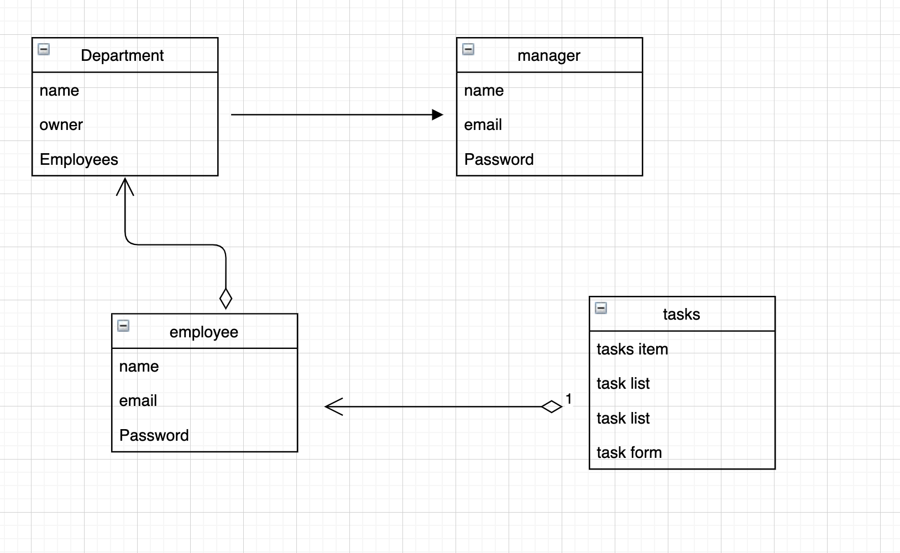

# TashEagle WebApp
Refreshingly Easy To Use
Get everyone in your team on the same page. Quickly and easily assign tasks, and manage who is working on what, when.
All without the need for complex workflows, on-boarding or training.

## Our WebApp Deployment

## Technologies Used
  - React
  - React-Bootstrap
  - JSX
  - CSS
  - Express
  - Mongo / MongoDB
  - Axios
  - Route

## Website ERD, Wireframe and User Stories
### ERD

### Wireframe
#### Landing Page

#### Manager View Page

#### Employee View Page

### User Stories
- User should make an account by signing up
- If the user is manager then the user will sign-in to the manager view
- If the user is employee then the user will sign-in to the employee view
- Manager user can see all tasks and (Waiting, Complete, Inprogress)tasks
- Manager user can assign Tasks to employees
- Manager user can add an employee to the manager departments
- Employee user can see all tasks and the user (My Tasks, Waiting, Complete, In-progress)tasks
- Employee user can change tasks status to (complete, in progress, waiting )
- Employee user can send reports to the manager

## Challenges 
- Getting and sending the data to the backend 
- Working with bootstrap and designing the component

## Features and Improvements
- Add a chart to see the department progress status and data
- Add request feature to employee view, to enable employee asking for a task that needed done by        another employee
- Enaple the parts feature in task form to make any big task can be defide on multi parts